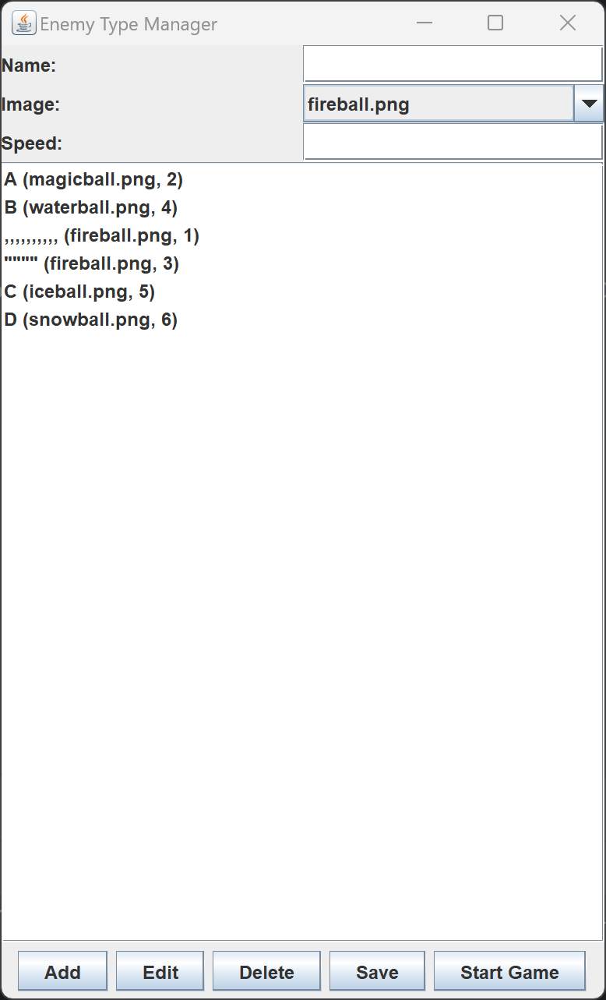
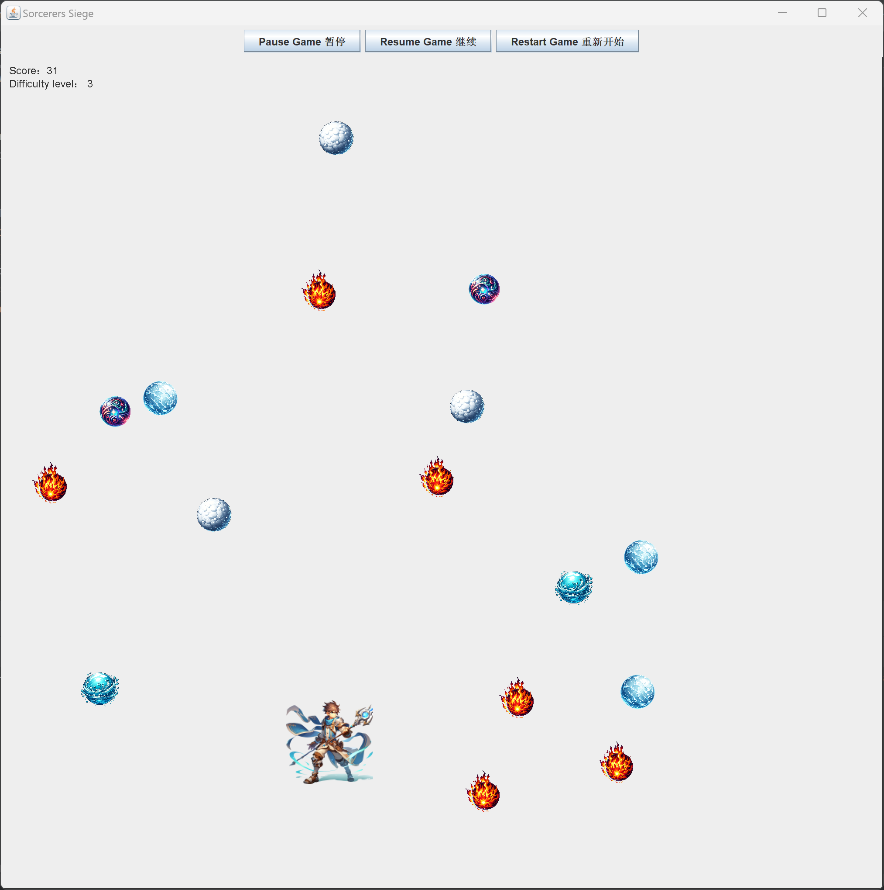

# Team Project
# Sorcerers Siege

## Overview

Sorcerers Siege is a fast-paced arcade-style game where players navigate a sorcerer through various challenges, dodging and defeating enemies with magical powers. Set in a mystical world, the game combines strategic gameplay with an engaging storyline and captivating graphics.

## Features

- **Customizable Enemies**: Choose from different enemy types, each with unique appearances and speeds.
- **Increasing Difficulty**: The game gets progressively harder, offering a challenging experience for players.

## Enhanced Features

### Graphical Interface for Enemy Management (CRUD)

Sorcerers Siege features a sophisticated Enemy Manager with a user-friendly graphical interface, enabling players to fully customize their gaming experience. This interface offers comprehensive CRUD (Create, Read, Update, Delete) functionalities, allowing for intricate control over the various types of enemies encountered in the game. 

#### Key Functionalities:

- **Create(Add)**: Add new types of enemies with unique attributes.
- **Read**: View the existing list of customizable enemies.
- **Update(Edit)**: Modify attributes of existing enemies to adjust their speed and appearance.
- **Delete**: Remove enemy types no longer desired in the game.

### Advanced CSV Handling

The game intelligently handles enemy data stored in CSV format, ensuring accurate parsing even when enemy names contain commas or double quotes. This robust system guarantees that the game will correctly recognize and process enemy data, maintaining the integrity of game settings and customization.

- **Comma Handling**: If an enemy's name includes a comma, the CSV parser encapsulates the name in double quotes, ensuring the comma is not misinterpreted as a field separator.
- **Quote Handling**: If an enemy's name contains double quotes, the system implements escape characters to preserve the original naming convention without causing parsing errors.

## Installation

To install Sorcerers Siege, follow these steps:

1. Clone the repository to your local machine.
2. Ensure you have Java installed on your system.
3. Use IntelliJ IDEA to open the file and run the main game file.

## How to Play

To embark on your Sorcerers Siege adventure, follow these steps:

1. **Customize Enemies in Enemy Manager**: Begin by launching the Enemy Manager window. Here, you can tailor the types and attributes of enemies to your preference. Add new enemy types, adjust their appearance and behavior, and prepare them for the game.

2. **Start the Game**: Once you are satisfied with your enemy setup, click the "Start Game" button in the Enemy Manager. This action will close the manager window and launch the main game.

3. **Navigate the Sorcerer**: Use the arrow keys on your keyboard to move the sorcerer across the screen. The game's controls are designed to be intuitive and responsive for a seamless gaming experience.

4. **Survive Against Enemies**: Dodge and weave through the enemies that you customized. Each type of enemy will have unique behaviors based on your settings in the Enemy Manager.

5. **Score Points**: Points are scored by surviving as long as possible against the onslaught of enemies. Challenge yourself!

## Screenshots

### Enemy Manager

*The Enemy Manager window allows players to customize the types and attributes of enemies in the game. Here, you can create, edit, and delete different enemy types, adjusting their appearance and speed to enhance the gameplay experience.*

### Game Window

*The Game Window showcases the main gameplay area. This is where the player navigates the sorcerer, encountering various magical enemies. The intuitive layout and dynamic visuals make for an engaging and immersive gaming experience.*

## References

- **OpenAI's ChatGPT**: Utilized for providing programming guidance, and generating content for this README.md File.
